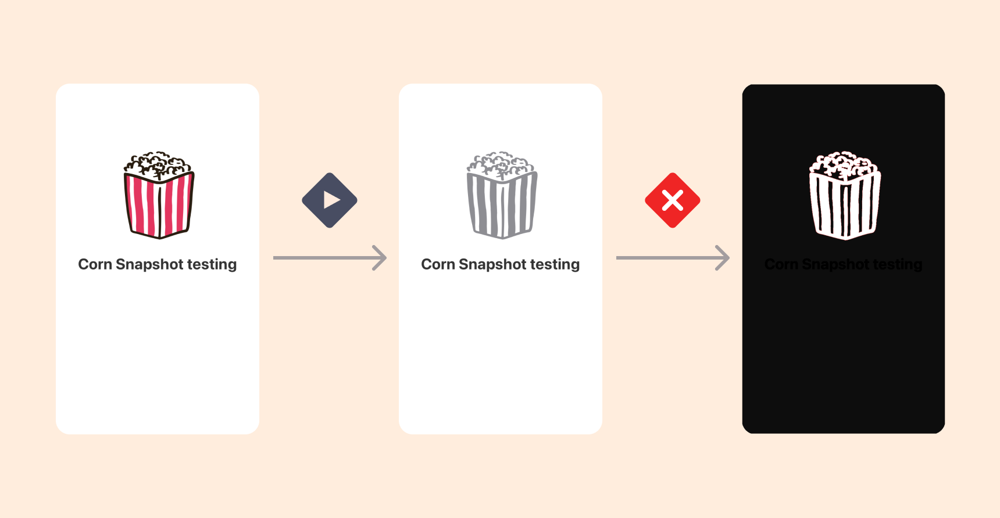
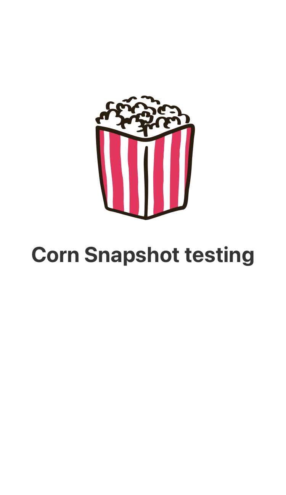
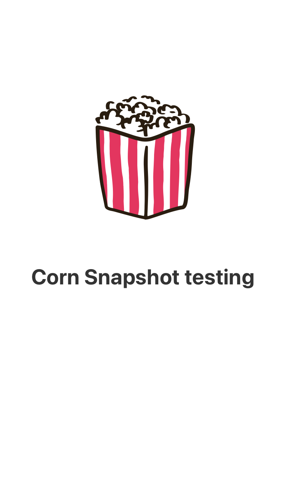
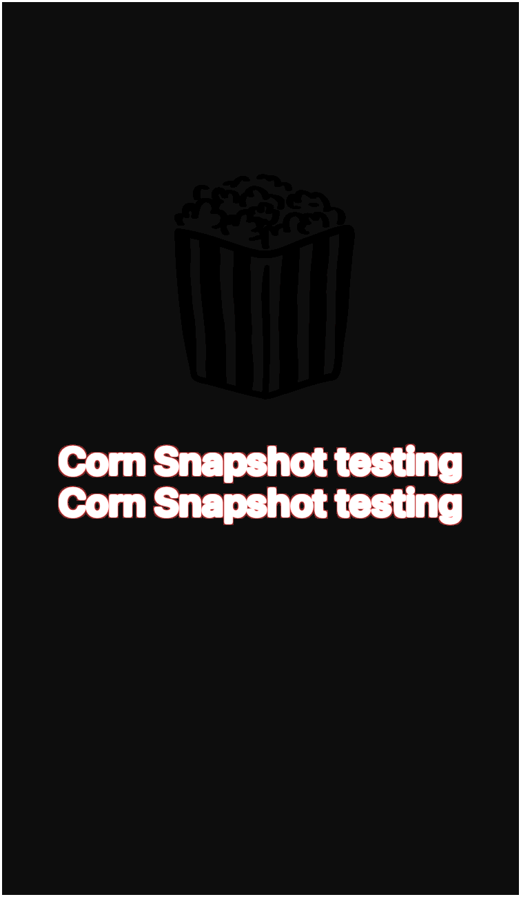
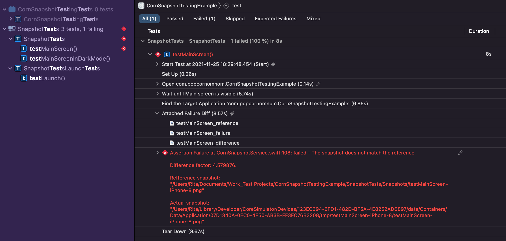

# CornSnapshotTesting

[](https://swift.org/download/)
[](https://img.shields.io/badge/Platforms-iOS-orange)
[](https://www.swift.org/package-manager/)
[](https://img.shields.io/badge/CI-compatible-green)
[](https://github.com/popcornomnom/CornSnapshotTesting/LICENCE.txt)

A low-maintenance, simple framework for a snapshot testing, which takes into account a snapshot difference factor (must have if you're using CI).



# Table of contents 
1. [Installation](#installation)
2. [Key Features](#key-features)
3. [Usage](#usage)
4. [Contributing](#contributing)

## Installation
### Swift Package manager

The Swift Package Manager is a powerful tool for managing the distribution of Swift code.
It’s integrated with the Swift build system to automate the process of downloading, compiling, and linking dependencies.
Therefore it's so easy to import `CornSnapshotTesting` dependency into your project.

1. Open project settings.
2. Switch to the `Package Dependencies` tab.
3. Tap on `+` button.
4. Past the current repository link or search for `CornSnapshotTesting`.

Feel free to check the [official documentation](https://developer.apple.com/documentation/swift_packages/adding_package_dependencies_to_your_app) to get more information about how to add a Package Dependency.

To add the `CornSnapshotTesting` to your Swift package, add the dependency into the Package.swift:  
```
dependencies: [
 .package(url: "https://github.com/popcornomnom/corn-snapshot-testing.git", from: upToNextMajor(from: "1.0.0")),
]
```

## Key Features
- [x] Compares the snapshot of the current window with the previously saved reference image. 
The `assertSnapshot` method is available in any sub-class of `XCTestCase`;
- [x] The test result depends on the similarity of images, taking into account the `tolerance` factor.
It's important value if you are using `CI` to run your tests and have the image quality discrepancy between your local machine and the `CI` tool's virtual machine;
- [x] By default, the snapshot folder path is equal to the caller's file path. But you can change the `path` if necessary;
- [x] Reference, actual and difference images are attached to the test results as `XCTAttachments`. 
Image difference factor is also available in a test error message.
- [x] The difference image highlights the areas of difference between the two snapshots.

## Usage
### `assertSnapshot`
The `assertSnapshot` method captures the current device's window snapshot and compares it with a previously saved reference image.
The reference image won't be changed in case of a failed test result.
Make sure that you call the `assertSnapshot` method when an app is already launched.

This method accepts the next parameters:
- *delay*: The time interval in seconds after which the snapshot will be taken. For example, the time needed for an animation to be completed.
- *name*: The snapshot file's name. By default, this value is equal to the function name.
- *path*: The path to the folder where the snapshot is placed. By default, this value is equal to the caller's file path.
- *folderComponents*: Additional components of the path for subfolders.
- *interfaceStyle*: The current interface appearance of the app during the test. It's used to add the current app theme to the snapshot file name.

All arguments are optional.
The `assertSnapshot` is available for external use, but not for an override on purpose.

#### Example 1:
```
func testMainScreen() throws {
  // Given -
  // Mock dynamic content here, such as images, json responses if needed.
  // Launch the app.
  let app = XCUIApplication()
  app.launch()
   
  // When - screen is visible.
  waitUntilMainScreenIsVisible()
   
  // Then -
  // Asserts snapshot with name `testMainScreen-iPhone-8.png` 
  // by `${current-file-path}\Snapshots\` path after 0 seconds.
  assertSnapshot()
}
```
Test case: After `stackView` `spacing` has been changed `+30pt`:

|      Reference      |        Actual       |       Difference       |
|     -------------      |      -------------      |      -------------      |
|  |  |  |



#### Example 2:
```
func testMainScreenInDarkMode() throws {
  // Given - stab the current user interface.
  let app = XCUIApplication()
  app.launch(interfaceStyle: .dark)
  //
  // When - screen is visible.
  waitUntilMainScreenIsVisible()
   
  // Then
  // Asserts snapshot with name "custom-name-dark-iPhone-8.png",
  // by `${current-file-path}\Snapshots\Main screen` path,
  // after 2 seconds.
  assertSnapshot(delay: 2, name: "custom name",
          folderComponents: "Main screen",
          interfaceStyle: .dark)
}
```

### `tolerance`
An example of changing tolerance factor:

```
CornSnapshotConfiguration.current.tolerance = 0.25 // tolerance used for Bitrise CI
```
By default, the `tolerance` value is `0`, meaning `CornSnapshotTesting` framework expects snapshots to match pixel-to-pixel. 
If you use the `CI` tool to run tests, you may have a difference in the image quality between devices.
Therefore, I would recommend using a higher `tolerance` value (for instance `0.25`).

### `higlighterColor`
```
CornSnapshotConfiguration.current.higlighterColor = .yellow
```

The color used by the difference image to highlight the areas of difference between the two snapshots.
By default `higlighterColor` is `red`.

## Important
To replace the reference image remove the previous one and run the test once more.

## How to check failed tests

You can find a reference, actual and difference images in failed test artifacts. The image similarity factor is also available in the corresponding test results.

#### Name structure of the snapshot:
```
{snapshot name}-{theme}-{device name}.png
```

This name convention was chosen on purpose taking into account that if attachments sorted by name, all images related to one test will be grouped together.

## Contributing
During `CornSnapshotTesting` framework development I aimed to include essential functionality into `1.0.0` version, to make it convenient to integrate into any project. With this intent, I've added only SPM support because it's available in any Xcode project. Also, I kept a few more points for improvement unimplemented.

If some functionality is missing, or you have any suggestions on how to improve the framework or you have time to make `CornSnapshotTesting` better by helping with the implementation of points bellow, feel free to create the Pull Request, Issue or ask me directly. (PR should be in suggestions format and shouldn't break the core logic).

### What's not there yet
- [ ] `CocoaPods`, `Carthage` support;
- [ ] macOS, tvOS support;
- [ ] Integration tests support - Asserting the current simulator window helps to keep the snapshot testing independent from the project implementation, but it would be nice to have `assertSnapshot(view: UIView, delay: _, name: _, folderComponents: _, interfaceStyle: _)` method in place;
- [ ] Tests.

# Footnotes
## From the author
I hope publishing this framework as open-source will make a contribution to the community and help someone to save time by using what I've written and tested.

### Credits
A heartfelt thanks to [**Miloskiy**](http://miloskiy.com) for the awesome design!
Also thanks to [@Chieh Wang](https://github.com/Chieh-Wang/) for help by suggesting to dig more into [Vision direction](https://developer.apple.com/documentation/vision).

Your support has made this project happen.

## Licence 
[**MIT**](LICENSE)

---

> Blog [popcornomnom.com](http://www.popcornomnom.com) &nbsp;&middot;&nbsp;
> GitHub [@popcornomnom](https://github.com/popcornomnom) &nbsp;&middot;&nbsp;
> Linkedin [@popcornomnom](https://linkedin.com/popcornomnom)
